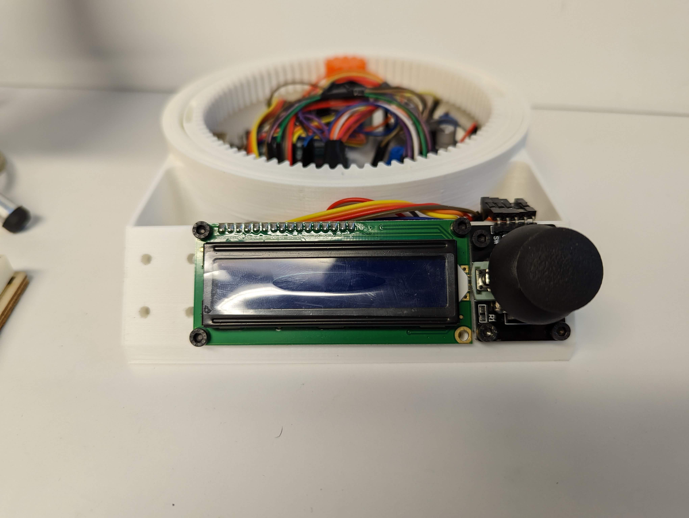
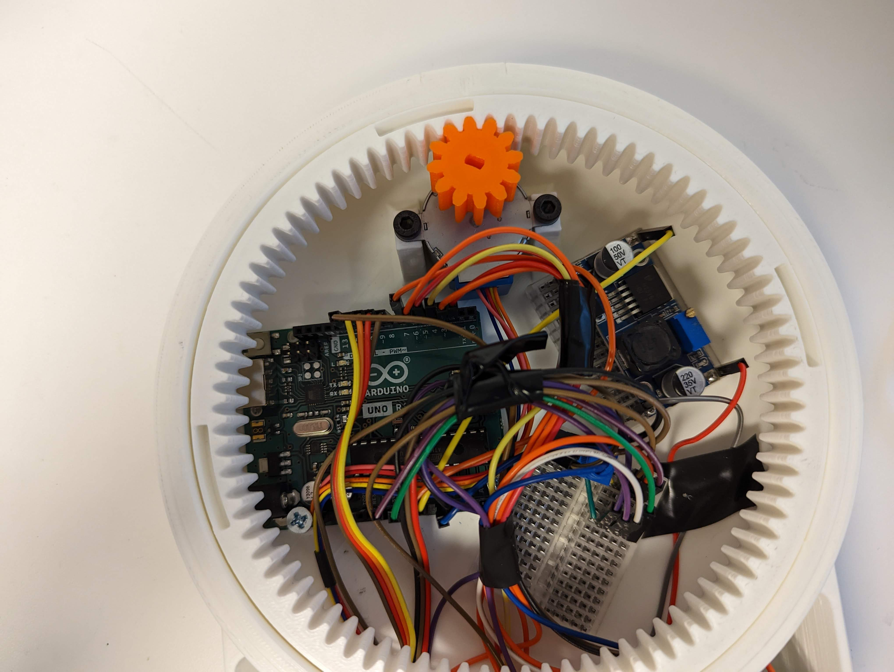
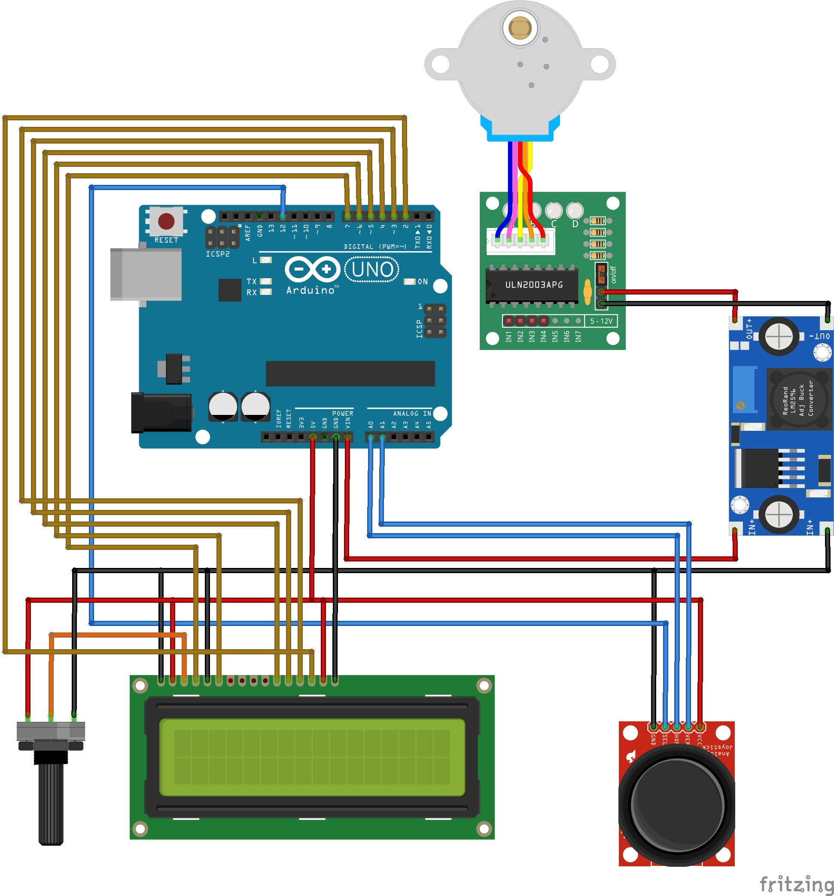

# How to run Arduino Turntable
*Credits to [Brian Brocken](https://hackaday.io/project/168301/components) on Hackaday for the wiring and housing*
## You will need (Parts are linked):
* Arduino IDE
* [Arduino Uno](https://store-usa.arduino.cc/products/arduino-uno-rev3)
* [Stepper Motor Driver](https://www.makerfabs.com/uln2003-stepper-motor-driver.html)
* [Small Stepper Motor](https://www.adafruit.com/product/858)
* [Joystick](https://usa.banggood.com/JoyStick-Module-Shield-2_54mm-5-pin-Biaxial-Buttons-Rocker-for-PS2-Joystick-Game-Controller-Sensor-p-1566502.html?imageAb=1&rmmds=search&cur_warehouse=CN&akmClientCountry=America&a=1658158516.793&akmClientCountry=America)
* [Potentiometer](https://www.adafruit.com/product/4133)
* [DC Stepdown](https://www.banggood.com/LM2596-DC-DC-Verstellbar-Step-Down-Schaltregler-Power-Supply-Module-p-88252.html?p=E01411629100201406T1&custlinkid=255154&cur_warehouse=CN)
* [16X2 LCD Screen](https://www.adafruit.com/product/1447)
* [12V Power Supply](https://www.adafruit.com/product/798?gclid=Cj0KCQjwidSWBhDdARIsAIoTVb1DXxjJjmb-enC65o3dptGDhoo0HTmImXi5Flr680zAtAWfCA0VjS0aAuKeEALw_wcB)
* 4.0X16mm Wood Screw
* 3.0X5mm Wood Screw
* [3D printed housing](https://hackaday.io/project/168301/components)
## Assemble Turntable
### Step 1
Attach the LCD Display and Joystick onto the front plate using the 3mm wood screws.

### Step 2
Attach the Stepper Motor Driver and Arduino to the bottom plate using the 4mm wood screws.

### Step 3
Wire the turntable as shown below. Note: You need a multimeter to get the correct power output from the DC stepdown.

### Step 4
Flash the [Arduino turntable code](Turntable.ino) onto the Arduino Uno.

## Using the Turntable
The turntable UI can be navigated using the joystick. Pushing the joystick **UP** or **DOWN** will help you scroll through menus and changing options.

Pushing the joystick to the **LEFT** will take you to the previous menu.

The turntable has 3 modes:
* **Serial** - This mode will open the serial port and allow you to send commands to the turntable. You can use this mode to sync it with your DSLR or Rig using [this file](camerarig.py) and changing the serial port, file output, and amount of photos to take.
  * **Sync Mode** - This mode will sync your turntable with the motorized rig and camera. Edit the amount of photos to take, the serial input ports of both rail and turntable, and the output path of [this file](syncmode.py) to use this mode.
  * **Regular Mode** - This mode will allow you to sync the turntable with the camera. This mode takes in the amount of photos to calculate the intervals and where to stop. Edit the amount of photos to take, serial input port, and the output path of [this file](camerarig.py) to use this mode. 
* **Revolve** - This mode will allow you to set the speed of the turntable and letting it revolve one full revolution.

* **Manual** - This mode will allow you to use the joystick to control the direction of the turntable.
